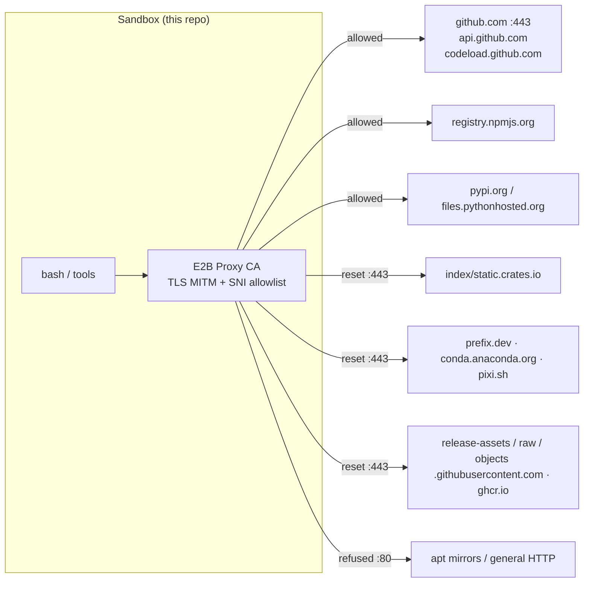

# What the Constraints Imply

## 5. What this means for the intended project

> [!NOTE]
> Everything below is *achievable in CI*; the left column is what fails locally in this sandbox.
>
> **Host change (2026-09-19):** the left column describes the E2B box (§1–§5), which is closed. On the
> current authoring host (open egress, conda-forge reachable) the `pixi`/`cargo` rows are executed, not
> simulated: `pixi` 0.80.0, `rustc`/`cargo` 1.98.1, `pixi-pack`/`pixi-unpack` 0.7.11 and `convco` 0.7.2
> all run here, and the §16.8 probe in [research/pixi-pack.md](/research/pixi-pack.md) ran the full
> `pixi → pixi-pack → file:// channel → pixi install/run → pixi-unpack` loop end-to-end.

| Goal | Feasible here? | The only viable path |
|---|---|---|
| Write/iterate Rust + clap + thiserror CLI code | ✍️ write yes, 🔨 compile no | Author the crate, `git push`, let **GitHub Actions** build it (`dtolnay/rust-toolchain` + `cargo build` on ubuntu-latest) |
| Dogfood the kit tool on this box (consume a published kit) | 🟡 D0/D1 yes, D2 needs a seed | **D0** — detection/digest/error-code fixtures need no toolchain at all; **D1** — the whole git→verify→tar path is exercisable today (measured above); **D2** — needs `pixi` in a branch (verify it with the API digest ✅); **D3** (compile) — CI only |
| Offline/vendored Rust build (`cargo vendor`) | ✗ locally | Generate `vendor/` **in CI** or on a networked machine and commit it; `.cargo/config.toml` source-replacement block is still authored here |
| Real `pixi` experiment (`pixi init/add/run/lock`) | ✗ | Write `pixi.toml` + `pixi.lock` expectations as artifacts; validate with `prefix-dev/setup-pixi` in Actions |
| `pixi-pack`-style offline environment pack | ✗ (needs channel downloads) | Design it; add a CI job that runs `pixi exec pixi-pack` on a runner with internet |
| Node/bun workspace interop | ✅ node 22, npm 10 **and bun 1.4.2** (bun via `npm i bun`, measured) | Prototype `bun install` / `bun ci` / `bun.lock` and the `node_modules` packing logic **locally**; only the pixi/cargo half stays CI-only |
| Full **Astro/Starlight docs build**, offline | ✅ | `npm i astro @astrojs/starlight` (227 MB / 33 s ✅) → `astro build` (8 pages, 5.7 MB, 4.6 s ✅) → rebuild with the proxy blackholed ⇒ **byte-identical** ✅; `starlight-links-validator` runs against `dist/` ✅ — the one complete dependency build this box can do, hence the D1.5 tier in `workflows/dogfooding.md §7.1` |
| Docs: `AGENTS.md`, `OKF` bundle, enhanced Markdown | ✅ | Author here, and the Markdown actually renders on GitHub after push |
| Serve a preview app | ✅ | bind `0.0.0.0:{port}` via a **background process** (not `bash &`), rely on `{port}-{sandboxId}.e2b.app` |

> [!IMPORTANT]
> **Five of the nine rows are now local on the 2026-09-19 host.** With conda-forge reachable, "real `pixi`
> experiment", "`pixi-pack`-style offline pack", "offline/vendored Rust build", "proto / collect / …" and
> the kit-consumption dogfood (D2, now that `pixi` installs here) are all *executed* — the E2B-era "Pixi
> experiments are CI-only" conclusion is historical. The E2B rows above are kept verbatim so the design's
> reasoning remains auditable; the wider-host version is in
> [inventory §6](/environment/inventory.md#6-re-measurement-2026-09-19-the-host-this-corpus-is-now-edited-on)
> and [network-model §4.4](/environment/network-model.md#44-re-measurement-2026-09-19-the-authoring-host-is-no-longer-the-e2b-airlock).

Practical traps found while probing:

* **`pixi` is a poisoned search/install name.** `pip download pixi` succeeds, but PyPI's `pixi 1.0.1` is
  *"A command line tool to download images from Pixiv"* by `azuline` — not the package manager.
  npm has `pixi` = "Node Pixi Renderer" (PixiJS legacy). So never `pip install pixi` / `npm i pixi`
  to obtain prefix-dev's pixi; the real one lives only on conda-forge + GitHub releases.
* **No `.tar.gz` asset for linux pixi at the obvious URL.** `…/releases/download/v0.81.0/pixi-x86_64-unknown-linux-musl.tar.gz`
  returns `404`; the linux x86_64 assets are the bare `pixi-x86_64-unknown-linux-musl` and its `.tar.gz`/`.sha256`
  siblings under the *actual* tag — enumerate them via `api.github.com` before writing a download step.
  Then remember the download host itself is blocked here.
* **`gh` is old (2.23.0)**: several newer subcommands/flags (e.g. some `gh project`, `gh variable`, `gh ruleset`)
  won't exist — drop to `gh api`/`curl` against `api.github.com`.
* **Authenticated as an App bot**, not as the repo owner: `gh auth status` →
  `Logged in to github.com as arena-ai-coding-agent[bot] (GH_TOKEN)`; `GET /user` returns
  `403 Resource not accessible by integration` (normal for GitHub App installation tokens, and it means
  token-scoped identity checks in workflows will behave differently than a PAT).
* **Repo permission snapshot is misleading**: `GET /repos/Archont561/pixi-sandbox` reported
  `permissions: {admin:false, push:false, …}` while `git push --dry-run` offered
  `* [new branch] arena/01a0b663-pixi-sandbox`. Treat `permissions` from the API (viewer = bot) as not
  authoritative for the human owner.
* **`sudo` is real but useless for provisioning**, because apt's transport is blocked.

## 8. Networking consequences for anything we build

Rules of thumb derived from the above:

1. **Never assume a network fetch works**; check the host against §4.3 first. A failure costs ~0 s (instant reset), so probe cheaply with `curl -o /dev/null -w '%{http_code}'`.
2. **Clone, don't download.** Source via `git clone`/`codeload` tarballs is the only way to obtain third-party code (that is exactly how I inspected `prefix-dev/pixi` and `Quantco/pixi-pack`).
3. **Cache outside git, but inside the workspace** if you want it to persist across turns; `/tmp` does not persist.
4. **Offline-first design is not a nicety here, it is the only honest design** — see the pixi `--offline`/`--locked`/`--frozen` and `cargo vendor` material in [the research log](/research/index.md).

## 9. Files, tools and directories that are *not* available for the plan

* No `rustfmt`/`clippy`/`mirr`/`rust-analyzer` (no rustup), so **formatting and lint gating must live in CI** (`cargo fmt --check`, `cargo clippy -- -D warnings`, `taplo fmt`, `prettier --check`).
* No `pre-commit` binary; `.pre-commit-config.yaml` can still be committed and run in Actions.
* No `git-lfs` verified (treat large-binary workflows as unavailable).
* No container runtime → no `docker build` rehearsal, no `pixi` OCI image test locally.
* No `act` for running Actions workflows locally (`docker`-backed).

---
