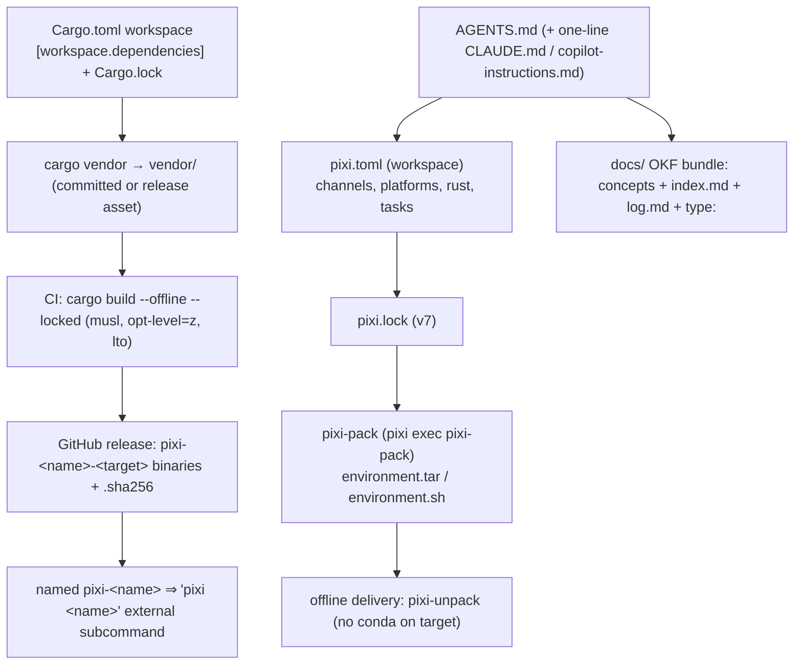

# How the research collapses into this design

## 12. Synthesis for this repo

If the goal of `pixi-sandbox` is *"a Rust CLI, distributed via conda-forge + pixi, built in GitHub
Actions, documented as an agent-consumable knowledge base"*, the research converges on one design:

Concrete constraints to design around (from [the sandbox measurements](/environment/index.md)):

1. **Nothing compiles here.** Author + review locally; compile in Actions. Gate with `cargo fmt --check`,
   `cargo clippy -- -D warnings`, `taplo fmt --check`, `prettier --check`, `zizmor` (all of which upstream
   pixi-pack runs via a `lint` feature) ✅ verified locally.
2. **Two vCPUs / 3.8 GiB / no swap** — keep the dep graph tiny (`clap` + `thiserror` + `anyhow` + `serde`;
   avoid `reqwest`+`tokio` unless genuinely needed); prefer `--offline`/`--locked` in CI so a flaky
   registry can't re-resolve.
3. **Name your binary `pixi-<name>`** if you want `pixi <name>`; clap's `allow_external_subcommands` +
   a `find_external_subcommand` PATH walk is the whole contract (§6).
4. **Ship an offline artifact** — either a `cargo vendor` tree (Rust deps) or an `environment.tar`
   (conda env). `pixi-pack --create-executable --pixi-unpack-source <internal URL>` is the air-gap
   pattern, and `setup-pixi`'s `pixi-url`/`pixi-url-headers` inputs are its CI-side counterpart
   [5](https://github.com/Pe44e/setup-pixi), [3](https://github.com/Quantco/pixi-pack).
5. **Actions hygiene:** trigger `pull_request`+`push` on `main` only; `concurrency` keyed on
   `github.ref` with `cancel-in-progress` on PRs; pin actions by SHA; `permissions: read-all`;
   `pixi-version` pinned; `cache-write` only on `main` (10 GB cache budget); no more than 256 matrix
   combos and ≤ 6 h per job [7.2–7.5](/research/github-actions.md#7-github-actions--branch-constraints).
6. **Docs double as machine-readable knowledge:** `README.md` (GitHub-enhanced Markdown, §8) + `AGENTS.md`
   (≤ 32 KiB, verifiable commands, §9) + an **OKF** `docs/` bundle (§11) — `type:` front matter, path as
   identity, `index.md`/`log.md`, ISO-8601 `generated.by/at`.

---
