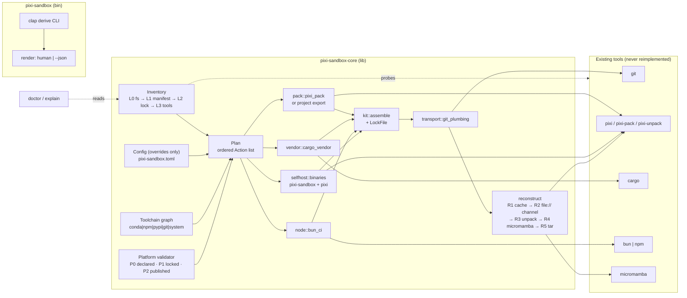

# Architecture

## 4. Architecture

### 4.1 Two crates, one binary

```
pixi-sandbox/
├── Cargo.toml                  # [workspace] resolver="3", [workspace.dependencies]
├── rust-toolchain.toml         # rustup hosts only (pixi's `cargo` is not a rustup proxy)
├── pixi.toml                   # the workspace that *builds the tool* (rust, bun, python, lint envs)
├── pixi-sandbox.toml           # the config the tool reads (dogfooded: it manages its own repo)
├── crates/
│   ├── pixi-sandbox/           # BINARY: clap definitions + rendering + exit codes. ~300 lines, no logic.
│   │   └── src/{main.rs,cli.rs,render.rs}
│   └── pixi-sandbox-core/      # LIBRARY: all logic, thiserror-typed, zero I/O surprises. (renamed from sandbox-core per Cargo convention D22)
│       └── src/{config,host,exec,hash,lock,inventory,platforms,toolchain,pack,vendor,node,kit,transport,selfhost,doctor,plan}.rs
├── .knowledge/                 # the OKF v0.2 knowledge bundle (this corpus): index.md, log.md, 5 areas
└── .github/workflows/{ci,release,dist,reusable-publish}.yml
```

Rationale: the `bin` crate is a thin shell so `cargo install --git` output stays readable and so the whole
behaviour is testable through the library API (pixi-pack v0.7.11 uses exactly this `src/lib.rs` +
`src/bin/*.rs` shape ✅ verified). `pixi-sandbox-core` is publishable to crates.io later without changing shape — kebab-case `pixi-sandbox-core` → import `pixi_sandbox_core`, prefixed to avoid collision (D22).

### 4.2 Layering



The `Inventory` node sitting *above* `Plan` is the architectural statement of this revision: everything
else — components, environments, platforms, rungs — is an *input* to detection or an *output* of it, and
`Config` is deliberately drawn as just one more input rather than the entry point.

### 4.3 The two abstractions everything else hangs off

**`Action`** — a *description* of one external command, with its intent, so the same object serves
dry-run, JSON, logging, and execution:

```rust
pub struct Action {
    pub id: String,            // "pack.rust.linux-64" — stable, greppable
    pub intent: String,        // "pack env `rust` for linux-64"
    pub program: String,       // "pixi"
    pub args: Vec<String>,     // exec-argv, already fully resolved
    pub cwd: PathBuf,
    pub mutates: bool,         // false => safe to run even under --dry-run (probes)
    pub produces: Vec<PathBuf>,// artifacts to hash into the lock file
    pub requires_hosts: Vec<String>, // ["conda.anaconda.org"] => doctor can preflight it
}
```

* `mutates == false` is what makes `--dry-run` still able to *read* the world (versions, `cargo metadata`).
* `requires_hosts` is the sandbox-aware bit: before executing, `Action::preflight()` can consult the
  measured allowlist and fail with "this needs `index.crates.io`, which is unreachable from this network —
  run it in CI, or `pixi sandbox vendor sync` on a machine with egress" instead of an opaque TLS reset.

**`LockFile` (`sandbox.lock.json`)** — the single source of truth about what a kit contains
([§9.1](/spec/artifacts.md#91-sandboxlockjson--the-integrity-manifest)). Every mutating subcommand ends by upserting into it;
every read-only subcommand can *verify* against it. Idempotence and integrity are the same object.

### 4.4 Discovery: the `Inventory`

Requirements (a), (b) and (c) in one mechanism.

**Rule: the tool must be useful on a repo it has never seen, with zero config.** Every verb starts by
building an `Inventory`; `pixi-sandbox.toml` only *overrides* what discovery found (and says so in
`plan` output: `"vendor": detected → enabled`). This is what makes "pack an arbitrary environment" real:
`pixi sandbox pack --env training` on a stranger's workspace must work without editing their config.

Detection is **tiered by privilege**, because the tools it would normally ask are exactly the ones a
sandbox blocks:

| Tier | Source of truth | Requires | Always available here? |
|---|---|---|---|
| **L0 filesystem** | files present/digests: `pixi.toml`, `pyproject.toml`, `pixi.lock`, `Cargo.toml`, `Cargo.lock`, `vendor/`, `.cargo/config.toml`, `package.json`, `bun.lock`/`bun.lockb`, `package-lock.json`, `pnpm-lock.yaml`, `yarn.lock`, `git` state (branch, `rev-parse HEAD`, remotes) | none | ✅ **yes** |
| **L1 manifest parse** | TOML read of `[workspace]`/`[project]`, `[environments]`, `[feature.*]`, `platforms`, `channels`, `target.<plat>`, `[tasks]` keys | `toml` crate | ✅ yes (pure parse) |
| **L2 lockfile scan** | which conda subdirs actually appear per environment/platform (regex over `pixi.lock`'s `conda:` channel URLs), lockfile `version:`, named-platform entries | none (line-oriented scan; labelled `heuristic: true`) | ✅ yes |
| **L3 tool interrogation** | `pixi info`/`pixi list`, `cargo metadata`, `bun --version`, `pixi-pack --version` | those binaries | ⚠️ only where installed |

```rust
pub struct Inventory {
    pub root: PathBuf,
    pub manifest: Option<Manifest>,        // kind: Pixi|PyProject, name, channels, platforms, tasks
    pub environments: Vec<Environment>,    // name, features, solve_group, no_default_feature,
                                           // per-env platforms + channels (L1), packages per platform (L2)
    pub lock: Option<LockfileFacts>,       // pixi.lock: version, env->platform->package count, digest
    pub rust: Option<RustFacts>,           // Cargo.lock present? workspace members? vendor/ + config?
    pub js: Option<JsFacts>,               // package.json + which lockfile + text-vs-binary lock
    pub tools: Vec<ToolFacts>,             // pixi, cargo, rustc, bun, npm, pixi-pack, tar, git(+version)
    pub network: Vec<HostFacts>,           // measured allowlist: open | reset | refused | unknown
    pub detected: Vec<Component>,          // Env | Vendor | Node | Self — drives `--components auto`
    pub gaps: Vec<Gap>,                    // platform/package/egress holes, with the reason + tier
}
```

The authority behind each tier — which manifest keys exist, what `pixi` will and won't answer offline,
and the probe that would promote the two ⚠️ rows to ✅ — is recorded in [Manifest discovery, platform validation, offline reconstruction §15](/research/rev2-discovery.md#15-rev-2-research-manifest-discovery-platform-validation-offline-reconstruction).

Consequences that fall straight out of this table:

1. **Component selection is derived, not declared** ([§8](/spec/packagers.md#8-the-three-packagers)): `Cargo.lock` →
   `vendor`; `pixi.lock` → `env`; a JS lockfile → `node`; the repo's own built binary → `self`. Absent
   markers ⇒ that component is `not-applicable`, never an error. A missing `Cargo.lock` (library repo)
   downgrades to `warn` with the remediation `cargo generate-lockfile`.
2. **Degradation is reported, never hidden.** Each `Gap` carries the *tier* that produced it, so `plan`
   can say "environments `training`,`gpu` were enumerated by L1 parse; per-platform package coverage is
   unverified because `pixi.lock` scan is L2 heuristic — pass `--strict` with pixi installed to confirm".
3. **`--offline` changes nothing about detection** (L0–L2 need no network), which is precisely why the
   tool can be *diagnostic* in a sandbox where it cannot be *executive*.

---
