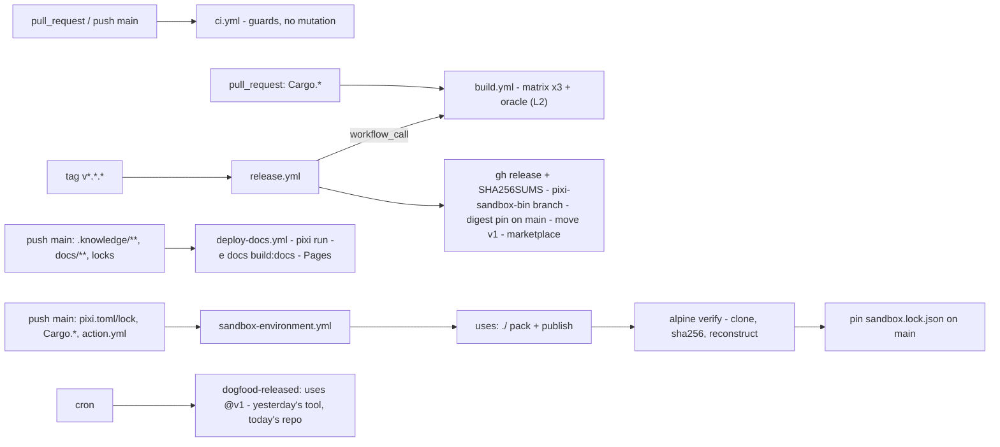

# The Repository's Workflow Set

[CI Design](/spec/ci.md) owns the *job set* — the lint/test/golden/e2e jobs the tool's CI eventually runs.
This concept owns the **file topology**: which `.github/workflows/*.yml` files exist, what each one is
allowed to mutate, which of the **two actions** every job calls, and the naming/splitting rules that keep
the set legible. It was drafted from the five-workflow request (ci, deploy-docs, release, build,
sandbox-environment, plus a reusable caching action) and reconciled with what D1–D21 already decided —
where the request and a decision collide, the collision is named, not smoothed.

> [!IMPORTANT]
> **Nothing here has executed.** No workflow file exists yet (the repo is markdown-only until M1
> ✅ [AGENTS.md](https://github.com/Archont561/pixi-sandbox/blob/main/AGENTS.md)); every YAML block below is
> a design sketch, and the whole concept is `status: draft` pending review. What *is* verified is everything
> it leans on: the nine measured oracle outcomes ✅, the four CI-push rules ✅, the setup-pixi knobs ✅, the
> Pages mechanics measured in §8 of the docs playbook ✅, and the marketplace prerequisites from GitHub's
> docs ✅. The confidence labels mark that split line honestly.

## 1. The split: two actions, five workflows

| Unit | Kind | Trigger | Mutates | Permissions |
|---|---|---|---|---|
| `action.yml` (repo root) | **the product** ([Action Shape](/spec/action-shape.md)) — primary, marketplace | `uses:` from any repo, step-level | the dist branch | `contents: write` in the *caller's* scope |
| `.github/workflows/reusable-publish.yml` | reusable wrapper (D22) — opinionated, enforces runner matrix | `workflow_call` from any repo | the dist branch (via action) | `contents: write` |
| `.github/actions/setup-env/` | local composite — the env-setup **policy** | called by this repo's jobs | nothing (cache writes) | inherits the job |
| `.github/workflows/ci.yml` | guards | `pull_request` + `push: main` | **nothing** | `contents: read` |
| `.github/workflows/build.yml` | builds the binary | PR (`paths:`), `workflow_call`, `workflow_dispatch` | artifacts only | `contents: read` |
| `.github/workflows/release.yml` | ships a version | tag `v*.*.*` + dispatch | GH Release, `pixi-sandbox-bin` branch, the `action.yml` digest pin, the floating `v1` tag, marketplace listing | `contents: write` |
| `.github/workflows/deploy-docs.yml` | publishes the site | `push: main` (`paths:`) + dispatch | Pages | `pages: write` + `id-token: write` |
| `.github/workflows/sandbox-environment.yml` | the dogfood publish | `push: main` (`paths:`) + cron + dispatch | `pixi-sandbox-dist` branch + `sandbox.lock.json` | `contents: write` |

Five splitting rules, decided here:

1. **A workflow file is one trigger-plus-mutation boundary.** Checks live in `ci.yml` (which mutates
   nothing); every mutation — Pages, the dist branch, a release — gets its own file, so its permissions,
   concurrency and blast radius are readable from the `on:` + `permissions:` block alone. This is D19's
   rule 1 (least privilege) applied to file layout.
2. **The product action is the only *published* one.** The marketplace lists exactly the root
   `action.yml` of a public repo, and "repositories may include other actions metadata files in
   sub-folders, but they will not be automatically listed" ✅
   ([docs](https://docs.github.com/actions/creating-actions/publishing-actions-in-github-marketplace)).
   So dev-infra helpers live under `.github/actions/` and stay **local** — versioned with the repo, zero
   drift — until a second repo actually needs them.
3. **Shared job graphs travel by `workflow_call`, never copy-paste.** `build.yml` owns the build matrix;
   `release.yml` calls it. Two owners of a matrix means two matrices that drift.
4. **The env-setup policy is an action because four workflows repeat it.** ci, build, docs and the
   dogfood publish all need "install pixi, restore the right env slice, set the cache policy, put `pixi`
   on PATH". A ~30-line composite pins that policy in exactly one place; it is *not* machinery —
   `prefix-dev/setup-pixi` already does the caching ✅ ([setup-pixi](https://github.com/prefix-dev/setup-pixi),
   and [Research: GitHub Actions §7.5](/research/github-actions.md)).
5. **Every job carries `timeout-minutes`, `concurrency`, and SHA-pinned third-party `uses:`** (the L4
   audit in [Testing Strategy §3](/spec/testing-strategy.md#3-layer-detail)). The 6 h hosted-runner cap and
   the 10 GB cache ceiling are measured facts ✅
   ([Research: GitHub Actions §7.4](/research/github-actions.md#74-hard-platform-limits-matter-when-designing-a-pixirust-matrix)).



## 2. The workspace the workflows assume

The workflows reference one `pixi.toml` that does not exist yet — this is its sketch, so the task names in
the YAML below are anchored to something. Environments are features with a shared `solve-group`: one solve,
one `pixi.lock`, one cache key ✅.

```toml
[workspace]
name = "pixi-sandbox"
channels = ["conda-forge"]
platforms = ["linux-64"]

[environments]
default = { solve-group = "ci" }
lint    = { features = ["lint"], solve-group = "ci" }
dev     = { features = ["dev"],  solve-group = "ci" }
docs    = { features = ["docs"], solve-group = "ci" }

[feature.lint.dependencies]           # mirrors pixi-pack's lint feature set (ci.md §12 ✅)
rust = ">=1.85"                       # clippy + rustfmt ride along (conda-forge rust 1.98.1 ✅)
taplo = "*"
typos = "*"
convco = ">=0.7"                      # commit lint + changelog; all six conda subdirs ✅ (research/convco.md)

[feature.dev.dependencies]            # the compile env — §7.5's caveat applies:
rust = ">=1.85"                       # rustc calls its linker `cc` *through the activation scripts*,
gcc_linux-64 = "*"                    # so gcc + sysroot must be in the same env or linking fails ⚠️
sysroot_linux-64 = "*"

[feature.docs.dependencies]           # D8: bun's primary source is conda-forge ✅; npm is the fallback.
bun = ">=1.3"                         # known gap: no win-64 build (D10 would record `omitted`, not fail)
nodejs = ">=22.12"                    # astro 7's engine floor, measured §8.1 ✅

[feature.lint.tasks]
lint = "cargo clippy -- -D warnings"
fmt-check = "cargo fmt --check"
commit-lint = { cmd = "convco check" }                       # the range is appended by the caller
changelog   = { cmd = "convco changelog -s --output CHANGELOG.md" }

[feature.dev.tasks]
test = "cargo test --locked --all-features"

[feature.docs.tasks]
docs-sync = { cmd = "bun scripts/docs-sync.ts", inputs = [".knowledge/**/*.md"] }
"build:docs" = { depends-on = ["docs-sync"], cmd = "bun install --frozen-lockfile && bun run build", cwd = "docs" }
docs-check = { depends-on = ["build:docs"], cmd = "test $(find dist -name '*.html' | wc -l) -ge 30", cwd = "docs" }
```

`"build:docs"` keeps the requested name verbatim; `docs-check` keeps the page-count assertion because a
silent-empty docs build is the worst failure mode measured in this corpus (§8.2: a wrong `docsLoader`
signature produced a one-page site **with exit 0** ✅
([Publishing the Docs](/workflows/publishing-docs.md#82-five-things-that-broke-before-it-worked--each-one-cheap-to-avoid))).

## 3. `ci.yml` — the guards (mutates nothing)

```yaml
name: CI
on:
  pull_request: { branches: [main], types: [opened, synchronize, reopened, ready_for_review] }
  push: { branches: [main] }
concurrency:
  group: ${{ github.workflow }}-${{ github.event.pull_request.number || github.ref }}
  cancel-in-progress: ${{ github.event_name == 'pull_request' }}
permissions: { contents: read }        # the whole workflow needs nothing else

jobs:
  checks-l0:                            # the only jobs runnable in the authoring sandbox today ✅
    steps:
      - { run: npx js-yaml action.yml } # the L0 that caught the first action.yml draft's YAML bug ✅
  commit-lint: [PR-only · checkout fetch-depth: 0 · pixi run -e lint commit-lint -- $BASE..$HEAD]   # convco — research/convco.md
  lint:    [setup-env(lint),    pixi run -e lint lint, pixi run -e lint fmt-check, zizmor, actionlint, typos]
  test:    [setup-env(dev),     pixi run -e dev test]          # --locked --all-features
  goldens: [setup-env(dev),     plan/detect golden diffs]      # lands with the crate (M1)
  docs:    [setup-env(docs),    pixi run -e docs docs-check]   # the 104-findings validator ✅ §8.2
```

*(the bracketed lines are job-step shorthand, not YAML — the real file spells them out)*

Deliberate choices: `commit-lint` is PR-only and unconditionally fetches history — its range comes from
the event payload (`base.sha..head.sha`), the exact shape convco's own docs recommend ✅, so a push-merge
to main is never double-checked. **No `paths:` filter on this file.** A paths-filtered workflow shows as *skipped* on
unrelated PRs, and skipped cannot satisfy a required check — so the cheap guards stay unconditional and the
expensive, mutation-bearing files carry the filters. With a warm env cache the whole file is minutes, which
matters only against the private-repo minute budget ✅ (2 000/month —
[Research: GitHub Actions §7.4](/research/github-actions.md#74-hard-platform-limits-matter-when-designing-a-pixirust-matrix)).

## 4. `build.yml` — the matrix and the oracle

```yaml
name: Build binaries
on:
  workflow_call:
    inputs: { ref: string, fail-on-oracle: {boolean, default true} }
    outputs: { digests: {value: ${{ jobs.build.outputs.digests }} } }
  workflow_dispatch:
  pull_request: { paths: [Cargo.toml, Cargo.lock, src/**, crates/**] }
```

* **The matrix is D21's, not everyone's:** P0 = `x86_64-unknown-linux-musl` + `aarch64-unknown-linux-musl`
  (musl-static ⇒ zero runtime deps, alpine included ✅
  [The Assembler Binary §3](/spec/assembler-binary.md#3-distribution-mirrored-pinned-verified--exactly-like-the-pixi-pair));
  P1 = `x86_64-pc-windows-msvc`; macOS triples are P2, "added only when a user needs one — each is a
  vector, not a promise" ✅ ([Testing Strategy §3](/spec/testing-strategy.md#3-layer-detail)).
* Per-triple steps: checkout (SHA-pinned) → cargo cache keyed on `Cargo.lock` (third-party cache action,
  pinned by SHA) → `cargo build --release` → **the musl assertion**: `ldd` must say "not a dynamic
  executable", and the binary must smoke-run in an `alpine` container → artifact
  `pixi-sandbox-<triple>` + its sha256.
* **The `oracle` job (`needs: build`) is the release gate.** It replays the nine measured outcomes T1–T9
  ([Running the Action](/workflows/action-run.md#the-nine-outcomes-measured-in-this-sandbox)) against the
  *compiled* binary with stubbed drivers — the L2 layer
  ([Testing Strategy §2](/spec/testing-strategy.md#2-the-oracle-one-vector-table-two-implementations)):
  "a release is cut only when the released binary's behaviour equals the oracle's expectation, demonstrated
  by an actual CI run" ✅. A red oracle blocks `release.yml` because `release.yml` consumes these artifacts
  only through this workflow's outputs.
* `workflow_dispatch` gives the airlocked author a "CI is my compiler" button — the §7.2 loop, one click
  ([Dogfooding](/workflows/dogfooding.md)).

## 5. `release.yml` — ship a version (tag → marketplace)

Triggered by **tag push `v*.*.*`** (plus a dry-run dispatch). The order is the design:

1. `uses: ./.github/workflows/build.yml` at the tag ref → matrix + oracle.
2. **Gates before anything mutable happens:** oracle green; tag matches semver; the **convco
   cross-check** — the tag must satisfy `convco version` at the tag and *should* equal
   `convco version --bump` over the commits since the previous tag ⚠️ (a documented downgrade to warning,
   if it ever fights a deliberate skip); (L4 hygiene — the release-immutability checks a
   `actions-semver-checker`-style action provides, itself SHA-pinned).
3. `gh release create vX.Y.Z` attaches the per-triple binaries + `SHA256SUMS` + the release notes
   `convco changelog -s -m 1` generates at the tag — one convention, three consumers: the PR guard that
   checked the commits, the changelog that renders them, the semver that validates the bump
   ([convco](/research/convco.md)). The release body records *which run built it* — the provenance rule in
   [Testing Strategy §4](/spec/testing-strategy.md#4-dogfooding-stays-the-promotion-gate).
4. Mirror the same binaries to the orphan **`pixi-sandbox-bin`** branch — the digest source the root
   action pins ✅ ([The Assembler Binary §3](/spec/assembler-binary.md#3-distribution-mirrored-pinned-verified--exactly-like-the-pixi-pair)).
5. Commit the **digest-pin update to `action.yml`** on `main`. GITHUB_TOKEN pushes do not retrigger
   workflows ✅ (D19 rule 2) — which is *correct* here: the tag build already proved this code, and a
   re-run would be noise.
6. Move the floating **`v1`** tag onto that pin commit. Consumers pinning by SHA (the repo convention ✅
   ci.md) are unaffected by tag movement; consumers pinning `@v1` get exactly the pinned, oracle-green
   binaries.
7. **The marketplace listing itself is the one step CI cannot do.** Publishing requires accepting the
   GitHub Marketplace Developer Agreement and 2FA in the UI ✅
   ([docs](https://docs.github.com/actions/creating-actions/publishing-actions-in-github-marketplace)) —
   the workflow ends by printing that single manual step; the first time, tick "Publish this Action";
   afterwards the listing tracks subsequent semver releases. The workflow summary says which.

**The same bytes ride three channels, on purpose** (decided in review, 2026-09-19):

| Channel | Job | Lifetime / addressability | Who fetches it |
|---|---|---|---|
| workflow artifacts (`upload-artifact`) | the **internal handoff** build.yml → release.yml only | 90-day default retention ✅ ([GitHub Actions research §7.4](/research/github-actions.md#74-hard-platform-limits-matter-when-designing-a-pixirust-matrix)), per-run, never digest-addressable | nobody downstream — ever |
| **release assets** | the immutable public **record** at the tag; the marketplace listing points here; carries the authoritative `digest` field | permanent, tag-addressable | networked consumers (`gh release download`); the airlock's digest *cross-check* (api.github.com answers even where asset bytes are blocked ✅) |
| **`pixi-sandbox-bin` branch** | the **operational** channel: the digest `action.yml` pins and the fetch step actually reads | git protocol, blobs forever (D19 rule 4) | the action's fetch step **inside the user's CI** — *never the airlock*: the target clones only the kit branch, which carries a copy in its `bin/` |

The split is not redundancy, and neither extreme survives contact with the constraint set:

* **Artifacts-only** expires in 90 days ✅ and leaves `action.yml` nothing immutable to pin — a consumer
  could never verify what it fetched. Artifacts are plumbing between jobs, not a channel.
* **Release-only** breaks the product's core promise: `objects.githubusercontent.com` /
  `release-assets.githubusercontent.com` are **unreachable from the airlock** ❌ (measured,
  [Constraints](/overview/constraints.md#3-constraints-that-shape-the-design)) — precisely the
  machines D1 exists to serve. That is why D1's verdict is "publish artifacts **as git objects**, not as
  release assets" for anything a *target* consumes. The release remains load-bearing anyway: it is the
  tag-immutable public record of the `built` provenance class
  ([Git Registry §10.5](/spec/git-registry.md#105-self-hosting-the-branch-ships-pixi-and-the-tool)), and its
  `digest` field gives the airlock an independent check that the branch copy is the bytes the release
  published — *verify the mirror, not just the copy* ✅ (the api.github.com route is measured open).
* **Branch-only** works operationally but loses the human-facing record users of a marketplace action
  expect, and the tag-addressable snapshot (`gh release download v1.2.3`) — the branch is force-updatable
  by design, so it is a mirror, not an archive.

**And the binary's whole journey stays inside CI until the kit exists** *(clarified 2026-09-19, user
direction "the binary shouldn't be fetched on the airlocked host — the action fetches it in CI")*:
release assets + the `pixi-sandbox-bin` branch are **CI-only** channels; the action's fetch step verifies
the pinned digest, `publish` embeds the same bytes in the kit's `bin/` under `SHA256SUMS`, and the airlock
clones the kit branch and never talks to any other channel. The one-command far side that falls out of this
is [§5 of the user template](/workflows/sandbox-template.md#5-what-you-get-on-the-far-side-one-command).

Cost note: a musl-static clap/serde CLI is single-digit MB per triple, so the branch mirror and the
release assets are both cheap — the "blobs are forever" concern (D19 rule 4) applies to the 100 MB+ payload
classes, not to the tool itself.

Dry-run dispatch mode does steps 1–2 only — staging + a printed plan, the same `push: false` philosophy
the product action has for fork PRs (D19 rule 3 ✅).

## 6. `deploy-docs.yml` — Pages from the pixi env

The requested shape — cached pixi env, `pixi run build:docs` in the `docs` environment, `bun run build` —
kept as-is, hardened where this corpus has already measured the failure:

```yaml
name: Deploy docs
on:
  push:
    branches: [main]
    paths: [".knowledge/**", "docs/**", "pixi.toml", "pixi.lock", "bun.lock",
            ".github/workflows/deploy-docs.yml", ".github/actions/setup-env/**"]
  workflow_dispatch:
permissions: { contents: read, pages: write, id-token: write }   # D19 rule 1 ✅
concurrency: { group: pages, cancel-in-progress: true }
jobs:
  build:
    runs-on: ubuntu-latest
    timeout-minutes: 15
    steps:
      - { uses: actions/checkout@<sha> }
      - { uses: ./.github/actions/setup-env, with: { environments: docs } }
      - run: pixi run -e docs build:docs          # docs-sync → bun install --frozen-lockfile → bun run build
      - run: pixi run -e docs docs-check          # the page-count assertion — silent-empty has exit 0 ✅ §8.2
      - { uses: actions/upload-pages-artifact@<sha> # v5.0.0 current ✅; dotfiles excluded since v4
          with: { path: docs/dist } }
  deploy:
    needs: build
    runs-on: ubuntu-latest
    environment: { name: github-pages, url: "${{ steps.deployment.outputs.page_url }}" }
    steps:
      - { id: deployment, uses: actions/deploy-pages@<sha> }   # v5.0.0 current ✅
```

1. **`paths:` includes the sync *source*** — `.knowledge/**` — because the site is *generated* from it
   (§8.3 ✅); a concept-only edit that skips the docs build is the stale-docs trap. `pixi.lock`,
   `bun.lock` and the workflow/action files ride along: an environment or pipeline change must redeploy.
2. **The page-count assertion is a step, not a hope** (§8.2's silent-empty defense, measured ✅).
3. **`upload-pages-artifact` v5 excludes dotfiles by default** (change since v4 ✅ release notes) — which
   finally settles the `.nojekyll` question the corpus left open: Pages served from Actions never runs
   Jekyll (§8.4: it is "optional now" ✅), and the v5 uploader would drop it anyway.
4. `site` **and** `base` both set — either alone 404s every asset (§8.4, measured ✅); `docs-sync` reads
   `base` from `[docs]` config, never hardcodes it (§8.4's custom-domain warning).
5. **The tension with the corpus, named:** [Publishing the Docs §8.4](/workflows/publishing-docs.md)
   sketches `withastro/action` for the build+upload. The pixi-native path wins here on purpose — the docs
   env *is* the cache dogfood, and D8 makes bun a conda package ✅ — with `withastro/action` kept as the
   documented fallback should the conda-forge bun pin ever block (its npm fallback exists for exactly
   that). The 🔁 swap is one `uses:` line, not a redesign.

## 7. `sandbox-environment.yml` — the dogfood publish (D4's CI half)

```yaml
name: Sandbox environment (dogfood)
on:
  push:
    branches: [main]
    paths: ["pixi.toml", "pixi.lock", "Cargo.toml", "Cargo.lock", "action.yml",
            ".github/actions/setup-env/**", ".github/workflows/sandbox-environment.yml"]
  schedule: [{ cron: "0 3 1 * *" }]      # monthly: keep the branch warm, catch upstream drift
  workflow_dispatch:
concurrency: { group: dist, cancel-in-progress: false }   # pushes to ONE branch: serialize, never cancel
permissions: { contents: write }                            # D19 rule 1: this is the whole point of the file

jobs:
  publish:
    steps:
      - { uses: actions/checkout@<sha> }
      - { uses: ./, with: { branch: pixi-sandbox-dist, ship-pixi: true } }   # ← the product, on itself
  verify:
    needs: publish
    container: { image: alpine:latest }    # git + tar + zstd only — the airlock rehearsal
    steps:
      - run: git clone --depth 1 --single-branch --branch pixi-sandbox-dist "$GITHUB_SERVER_URL/$GITHUB_REPOSITORY" kit
      - run: (cd kit && sha256sum -c SHA256SUMS)
      - run: sh kit/assemble --print-rung  # the exact command an airlocked box runs
      - run: pixi run -e default test      # any green here is rung evidence, not assertion
  pin:
    needs: verify
    steps:
      - run: commit refreshed sandbox.lock.json digests to main   # D5: the lockfile lives on main
  dogfood-released:                        # cron + release-published
    steps:
      - { uses: archont561/pixi-sandbox@v1, with: { branch: pixi-sandbox-dist-warm } }
```

* **`publish` runs `uses: ./` — the strictest dogfood there is.** §7.7 already decided this shape: "the CI
  job is *the product's own action* … a stricter form of dogfooding than compiling a crate, because the
  release artifact and the thing under test are the same file" ✅
  ([Dogfooding §7.7](/workflows/dogfooding.md)). Every push to main exercises the *unreleased* action.
* **`verify` consumes what `publish` just pushed, from a clean container**, which makes this workflow the
  standing rehearsal for the M1.5 gate ([scripts §5.3](/workflows/scripts.md) and
  [ci.md §12](/spec/ci.md)'s `reconstruct-e2e`): git + tar only, digest check *before* execution, rung
  printed — the T1–T9 semantics exercised on a real kit, not fixtures.
* **`pin` closes D5's loop**: `sandbox.lock.json` on `main` records the digests the dist branch now
  carries. The GITHUB_TOKEN commit retriggers nothing ✅ (rule 2) — intended.
* **`dogfood-released` is the other fidelity tier**: `@v1` — *yesterday's* released tool against *today's*
  repo, G9's "the released binary's behaviour" gate ✅ (ci.md's `dogfood` job). Two tiers, deliberately:
  `./` tests what you're about to ship; `@v1` tests what you already shipped.
* Fork-PR safety by construction: the workflow never triggers on PRs (fork PRs have no write token —
  D19 rule 3 ✅), and `push: false` staging exists in the action for the day a fork flow is wanted.
* **This file doubles as the user template** *(decided in review, 2026-09-19)*: the copy-paste version
  users put in *their* repos is
  [Publishing Your Environment: the sandbox-environment Template](/workflows/sandbox-template.md) — the
  same shape with the published action ref instead of `uses: ./`, knobs as workflow-level `env:` (only the
  `uses:` ref must stay a literal — GitHub rejects expressions there ✅ runner #895), and the two-marker
  substitution convention + `ci.yml` L0 drift check that keep the renderings identical. Users copy the
  template concept; this repo's file is the dogfood rendering.
* Named alternative: [scripts §5.3](/workflows/scripts.md) called this file `republish.yml` and
  [Workflow C](/workflows/ci-republish.md) calls the loop "republish" — the verb survives in prose and in
  the action's `publish` output; the filename keeps the requested `sandbox-environment.yml`.

## 8. Naming, decided

| File | `name:` | Rejected | Why |
|---|---|---|---|
| `.github/workflows/ci.yml` | `CI` | `guards.yml` | `ci.yml` is the ecosystem-default lookup name; the guards *are* CI |
| `.github/workflows/build.yml` | `Build binaries` | fold into `release.yml` | PRs need compile feedback without cutting a tag; the matrix has one owner |
| `.github/workflows/release.yml` | `Release` | `marketplace.yml` | the marketplace listing is one step of seven; the file ships a *version* |
| `.github/workflows/deploy-docs.yml` | `Deploy docs` | `docs.yml` (§8.4's sketch name) | the file *deploys*; docs *checks* live in ci.yml — say the mutation, not the topic |
| `.github/workflows/sandbox-environment.yml` | `Sandbox environment (dogfood)` | `republish.yml`, `dist.yml` | the requested name says what lands — a sandboxed environment on a branch; kept |
| `.github/actions/setup-env/action.yml` | `Set up pixi environment` | `setup-pixi` | collides with prefix-dev's action — confusion, not homage; `setup-env` is policy, not installer |
| `action.yml` (root) | `pixi-sandbox` | (already decided, D19/D21) | the one marketplace-listed metadata file ✅ |

Conventions the set obeys (from §1's rules): kebab-case filenames, human `name:`, snake_case job ids,
kebab-case inputs (GitHub lowercases them anyway), `timeout-minutes` everywhere, third-party `uses:`
pinned by SHA with a trailing version comment (`@<sha> # v5.0.0` ✅ ci.md), and permissions that read
like the mutation table in §1.

## 9. Improvements over the first sketch, each traced

1. **Don't hand-roll the cache — the reusable action is *policy*, not machinery.** setup-pixi already
   caches from the lockfile hash and exposes `cache-write` and `environments` ✅; the composite only pins
   the policy: `cache: true`, `cache-write: ${{ github.event_name == 'push' && github.ref_name == 'main' }}`
   (protect the 10 GB ceiling ✅ — PR branches must not evict main's cache), `environments:` named
   explicitly (the documented gotcha: otherwise only `default` installs+caches ✅
   [Research: GitHub Actions §7.5](/research/github-actions.md#75-prefix-devsetup-pixi--the-ci-primitive)),
   `locked: true`, and `pixi-version` pinned, never `latest`.
2. **Checks in ci.yml, mutations in dedicated files** — the required-check/skipped-check trap in §3.
3. **`paths:` filters include the *inputs* of the pipeline**, not just the files you edited: `.knowledge/**`
   for docs (§6), the action's own sources for the dogfood publish (§7). Forgetting the input-side filter
   is the stale-artifact trap in both directions.
4. **The oracle is a release gate, not a test suite.** build.yml replays T1–T9 against the compiled binary
   and release.yml *consumes artifacts only through that job* (§4) — the promotion rule of
   [Testing Strategy §4](/spec/testing-strategy.md#4-dogfooding-stays-the-promotion-gate) made structural.
5. **Immutable `vX.Y.Z`, floating `v1`, digest pin in between** (§5's steps 4–6) — the order matters:
   binaries exist → branch mirrors them → `action.yml` pins → `v1` moves. Reversing any two steps ships a
   pin the release didn't prove.
6. **The marketplace has no API** ✅ docs — release.yml ends at the release and *says* the one manual step
   out loud (§5.7), instead of pretending automation reached the listing.
7. **Verify your own output before declaring success** (§7's `verify` job): the dogfood publish is also
   the M1.5 rehearsal, in the alpine container, with the digest check *before* any execution — T6's
   semantics on every push.
8. **Two dogfood tiers** (§7): `./` on every main push, `@v1` on cron — G9 needs both, and ci.md's
   `dogfood` job already demanded the released-binary variant ✅.
9. **Serialization, not cancellation, on the dist branch** (§7's concurrency): a cancelled mid-publish
   run and a queued one cost the same, but only one of them is readable afterwards.
10. **`upload-pages-artifact` v5's dotfile exclusion is load-bearing information** (§6.3): it retires
    `.nojekyll` from the open-questions register, with a *reason*.
11. **P0-first build matrix** (§4): the one-liner needs exactly the two musl triples
    ([Assembler Binary §3](/spec/assembler-binary.md)); every additional triple is CI minutes and a
    forever-promise — P1/P2 join when a target asks.
12. **`timeout-minutes` and SHA-pins are not decoration**: the 6 h job cap and the 10 GB cache ceiling are
    measured ✅, and the L4 pin-by-SHA audit is already specified ✅ — this concept just makes both true on
    day one.
14. *(added 2026-09-19 — "add convco via conda-forge via pixi for changelog + commit linting")* **One
    commit convention, three consumers**: `convco` rides the `lint` feature (conda-forge v0.7.2, all six
    subdirs ✅ — no win-64 gap, unlike bun); `commit-lint` is a PR-only ci.yml job fed the event-payload
    range; release notes are `convco changelog -s -m 1` at the tag; and `convco version --bump` is the
    semver cross-check in the release gates — the convention the lint enforces is literally the format the
    changelog and the gate read, so there is no second source of truth.
13. *(added in review, 2026-09-19 — "should the binary be released along with the action, or is attaching a
    build artifact enough?")* **Same bytes, three channels**: workflow artifacts are the internal build→release
    handoff only (90-day retention ✅ — never a distribution channel), release assets are the tag-immutable
    public record whose `digest` the airlock can cross-check via api.github.com ✅, and the
    `pixi-sandbox-bin` branch is the operational channel the action actually fetches — because the asset hosts
    are measured closed in the airlock ❌ while git is open ✅ (§5). The release requirement is moot anyway:
    publishing to the marketplace *is* creating a Release.

## 10. What is unproven here

* **Every YAML block in this file** 🚧 — no workflow exists yet; L0 (`npx js-yaml`) is the only
  layer this sandbox can run ✅ ([Testing Strategy §1](/spec/testing-strategy.md#1-the-split-that-organises-everything)).
* **The `oracle` job presumes the M1 binary** 🚧 — until `cargo build` exists, the gate is a placeholder
  that must not be flattered into "green".
* **`bun`-inside-pixi for the docs build is ⚠️ reasoned**: bun on conda-forge is verified ✅ (D8, v1.3.11,
  no win-64), but the composed `build:docs` chain ran on this box only via the npm path (§8.1 ✅). The
  first real `deploy-docs.yml` run settles it; the npm fallback is pre-approved.
* **The aarch64-musl cross-link on a hosted runner** 🚧 — `musl-tools` + `rustup target add` is the
  standard recipe, unmeasured here; if it fights, P0 shrinks to `x86_64` and the aarch64 triple becomes an
  `omitted[]` entry (D10's vocabulary) until fixed.
* **Zero-non-git-egress assertions inside `verify`** stay D17-open 🚧 — a deny-all proxy on hosted runners
  is unproven ([Dogfooding §7.3](/workflows/dogfooding.md)); the alpine container already proves the
  *tooling* floor without it.

---

**Decision points this concept leaves to the user:** (a) cron cadence for the dogfood/warm-up runs
(monthly here, weekly is fine); (b) whether `setup-env` is ever promoted to a cross-repo published action
(the path is §1 rule 2 — sub-folder, referable, never marketplace-listed); (c) whether `docs-check`'s
page-count floor (30) should read from `[docs]` config instead of the task line; (d) task-name style —
`build:docs` (requested) vs the `docs-*` family from §8.3 (both exist here, one is an alias).
