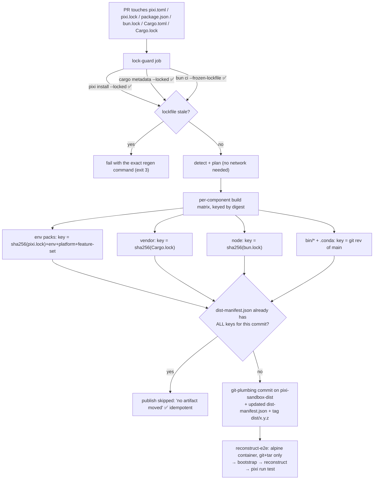

# Republishing When a Lockfile Changes

## 3. Workflow C — a dependency changed: CI republish



### 3.1 The three triggers, spelled out

| Trigger | Correct fix by the author | What CI does |
|---|---|---|
| `pixi.toml` edited, `pixi.lock` not | `pixi lock` (writes lockfile, no install ✅) or `pixi add` | `lock-guard` fails with that command; if it passes, **only the envs whose per-env hash changed** are re-packed — a `docs`-only bump must not re-pack `training` (300 MB) |
| `package.json` edited | `bun install` → text `bun.lock` ✅ (a `bun.lockb` is a hard failure with the migration command ✅) | re-publish `node/<digest>.tar.gz`; `node check` on every PR (cheap) |
| `Cargo.toml` edited | `cargo add` **then** `cargo vendor --locked --sync vendor` **then** `git add vendor` (or push the vendor branch) | re-publish `vendor/<sha256(Cargo.lock)>.tar.zst`; `vendor check` runs `cargo metadata --locked --offline` ✅ as the proof, so a *missing* crate in `vendor/` is caught in CI, not on the target |

### 3.2 The republish step, concretely

```bash
# 1. build only what moved — `--only-changed` diffs against the dist branch manifest
pixi sandbox kit build --all-envs --only-changed --against origin/pixi-sandbox-dist
# 2. publish via plumbing: no checkout, no tree mutation (/spec/git-registry.md §10.2)
pixi sandbox dist push --with-self --note "env:training+linux-64 @ $(sha256sum pixi.lock | cut -c1-12)"
# 3. tag for immutable addressing → consumers do `git clone --depth 1 --branch dist/0.4.2`
pixi sandbox dist tag --message "kit 0.4.2"
```

Three properties that make this safe to run on every push:

* **Idempotent.** Artifact identity is a content digest, not a timestamp: a second run with unchanged
  lockfiles pushes nothing and exits 0 saying *"no artifact moved"*. A dist branch that only ever appends
  when something actually changed is a branch you can force-push-gc later without losing reproducibility.
* **Additive per commit.** `dist push` writes one commit whose `dist-manifest.json` carries the union of
  live entries (`keep-last = 3` per artifact name ✅ `spec/git-registry.md §10.4`), so an old `rev` still resolves
  against the branch tip's manifest while history stays bounded.
* **Never auto-heals an integrity failure.** If `sha256sum -c` fails on the target, that's exit 4 and a
  human decision — the tool will not "re-download and retry", because in an airlock a retry loop is
  indistinguishable from a silent downgrade.

### 3.3 What the consumer of the *next* commit types (nothing)

```bash
pixi sandbox update --check        # compares local lockfile digests vs dist-manifest.json
# → "vendor: unchanged · env(training): STALE → pixi sandbox reconstruct --from <new kit>"
```

Agents and CI should be able to answer "is my kit current?" with that one read-only call, because in an
airlocked environment the cost of *discovering* staleness by trying to build is measured in hours.

---
