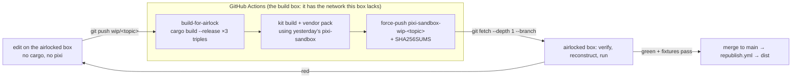

# Dogfooding on a Box Like This One

## 7. Dogfooding: developing `pixi-sandbox` on a box like this one

Everything above is written for *users* of the kit. This section is the answer to a harsher question: **can
`pixi-sandbox` be built and tested inside exactly the prison it exists for?** This repo's own dev sandbox
measured its egress in [Host Inventory and Verdict](/environment/inventory.md): GitHub git transport ✅, npm ✅,
PyPI ✅, and `static.crates.io` ❌ / `conda.anaconda.org` ❌ / `pixi.sh` ❌ / `apt` ❌, with no `rustc`, no
`cargo`, no `pixi` installed. That is a faithful airlock, so it is the test rig.

> [!IMPORTANT]
> Read the boundary correctly: this box cannot reach a *package manager*, which is **not** the same as "a Rust
> toolchain can't be airlocked". conda-forge ships `rust` 1.98.1 as an ordinary package ✅, so any target that
> receives a pack built from an env containing it **has `rustc` and `cargo`** — see §7.5 for what that changes
> and §8 for the one thing (`astro build`) that this box can already do end-to-end.

**One rule makes it dogfooding instead of theatre:** *every input to the dev loop must live in a git object
of a repo this box is allowed to fetch, or the loop does not run.* Not "should", not "with a fallback":
if a step needs a host outside the allowlist, that step is a bug in the design, not a limitation
of the sandbox. Consequence worth stating plainly: `pixi-sandbox` **consumes `pixi-sandbox`**, and the only way
in is a bootstrap seed that a human carries across the boundary once (§7.4).

### 7.1 The five fidelity tiers

| Tier | What it exercises | What it needs on the box | Status on this host |
|---|---|---|---|
| **D0 spec** | detection, digest keying, error codes, plan/JSON shapes — against *this repo's own* file shape | nothing (fixtures are markdown + JSON in-repo) | ✅ **runnable today** |
| **D1 transport** | `git clone --branch <dist> --filter=blob:none` → `sha256sum -c` → `tar -xf` → `--config` overlays, i.e. W2 minus `pixi` | `git`, `tar`, `zstd`, `sha256sum` ✅ all present | ✅ **runnable today** |
| **D2 env** | `pixi install --frozen`, `file://` channel, `pixi run`, offline re-solve | a `pixi` (and `pixi-pack`) **binary in a branch** — nothing else can deliver one | 🚧 needs the seed in §7.4 |
| **D1.5 docs** | a real dependency graph from an allowlisted registry: `npm i astro @astrojs/starlight` → `astro build` → static site | `node` ≥ 22.12 ✅ (`v22.22.3` here), npm registry ✅ | ✅ **runs end-to-end here** — 227 MB of deps in 33 s, 8 pages in 4.6 s, 5.7 MB `dist/` ([§8](/workflows/publishing-docs.md#8-publishing-the-docs-astro-starlight--github-pages-and-the-airlock-mirror)) |
| **D3 compile** | `cargo build` of the tool itself, per target triple | `rustc` + the 819-crate graph, **both offline** | ✅ **realistic for users**: `conda-forge::rust` *is* a toolchain package (`rustc`, `cargo`, and `rust-std-<triple>` per target ✅), so a pack carries the compiler and `[kit] targets-compile = true` is a supported config, not a wish — **but** this box has no conda/pixi at all, so *our* D3 stays in CI (§7.5) |
| **D4 self-host** | yesterday's `pixi-sandbox` builds and publishes today's kit, which tomorrow's CI consumes | D1+D2+D3, one loop | 🚧 the goal |

Measured transport (this host → GitHub, today): `git clone --depth 1 --single-branch` of `Quantco/pixi-pack`
= **2.10 MiB of objects in 754 ms** ✅, `codeload` snapshot of the same ref = 2.2 MB in 410 ms ✅,
`git fetch --depth 1` re-fetch = 997 ms ✅. So **the branch is not the slow part**: a 60 MB zstd vendor
snapshot is ~20 s and a whole kit under ~100 MB lands in well under a minute (at those rates even a
`rust`-bearing kit — roughly 0.5–1 GB unpacked, ⚠️ unmeasured here — is a minutes-scale fetch, not a stall), which is why D9's "vendor on a
disposable branch instead of `main`" costs nothing measurable and buys a clean review diff.

### 7.2 The loop (a normal day inside the airlock)



```bash
# on the box, after pushing wip/kit-size (CI has been building for ~6 min)
git -C workspace fetch --depth 1 origin pixi-sandbox-wip-kit-size
git -C workspace show pixi-sandbox-wip-kit-size:SHA256SUMS > /tmp/sums
git -C workspace checkout pixi-sandbox-wip-kit-size -- dist/ && (cd dist && sha256sum -c ../SHA256SUMS)
pixi-sandbox reconstruct --kit dist/ --mode auto --print-rung     # must print the guaranteed rung
pixi-sandbox kit verify --kit dist/ && pixi-sandbox doctor --check-egress
```

The `wip-<topic>` dist branches are **disposable** (`[dist] wip-ttl = "14 days"`; `dist gc --older-than` deletes
them) and are never tags — that keeps `main` free of build noise while making "CI is my compiler" a
one-command, ~10-minute loop instead of a philosophical objection.

### 7.3 Keep the simulation honest

The trap in "we tested it in CI": CI has full network, so a green `reconstruct-e2e` job proves nothing about
an airlock. Two defenses, both cheap:

1. **egress deny-all in the job itself.** Run the airlock-sim steps behind a proxy allowlisting exactly the
   hosts in [Host Inventory and Verdict §4.3](/environment/inventory.md) (`github.com`, `api.github.com`,
   `codeload.github.com`, `*.npmjs.org`, `pypi.org`, `files.pythonhosted.org`) via `HTTPS_PROXY`/`ALL_PROXY`,
   and *assert the negatives* (`curl -sSf https://static.crates.io/crates/serde/1.0.0.crate` must fail) — a
   sim that doesn't test its own blocks is a normal test with a cool name.
   🚧 open question: whether this is expressible on hosted runners (privileged container + `iptables`, or a
   sidecar squid) or needs a self-hosted runner — decide with D17.
2. **`doctor --check-egress` on the real target.** `pixi-sandbox` ships the allowlist as data
   (`fixtures/egress.json`, extracted from the constraint doc) and probes it, failing on both directions:
   a documented mechanism whose host is unreachable **and** an unlisted host that answers. This is the
   mechanism that stops the whole design from silently rotting when the sandbox policy changes — and it is
   itself a dogfooding test: on this box it must report `static.crates.io: unreachable ✅ expected`.

### 7.4 D0/D1 today: the parts that need no compiler

`D0` is already useful, because this repo is the **worst-case fixture**: a `Cargo.toml` workspace +
`Cargo.lock`, a `package.json` + `bun.lock`, **no `pixi.lock`** yet, and no `pixi.toml`. That combination is
exactly what `Inventory` (L0→L3) must survive, so freeze the expectations first and let Rust implement to
them:

| Case | Input (this repo, now) | Expected |
|---|---|---|
| `pixi-sandbox environments --json` | no `pixi.lock` | `[]` + note `pixi-toml: absent`, exit **7** `not-detected` ✅ semantics |
| `pixi-sandbox inventory --tier L0` | 2 JS/Rust lockfiles present | lists both ecosystems, `pixi: none`, **no** subprocess spawned |
| `pixi-sandbox kit build --dry-run` | `[pack] environments = "auto"` with no envs | empty env list + `not-applicable` for pixi, `planned` for vendor (per `Cargo.lock`), exit **0** |
| digest keying | `Cargo.lock` unchanged, `pixi.toml` added | one component changed ⇒ `--only-changed` republishes exactly `vendor` ✅ (the idempotency claim in §3.3 rests on this table) |
| `reconstruct --mode auto` | a `dist/` tree with no `pixi` on PATH | **R5** (`tar -xf`) with `unavailable: pixi`, exit **5** + rung printed ✅ |

Write those as golden files (JSON + exit code) in `fixtures/dogfood/` the moment code files are allowed —
until then they live as fenced blocks here and are the review checklist for the Rust implementation.

The **seed** D2 needs: `pixi` and `pixi-pack` are release *assets*, and `objects.githubusercontent.com` is
blocked here ❌, so the binaries must be committed into a branch of *our* repo by a networked machine —
which is tolerable rather than faithless because the airlock can verify them **itself**: `api.github.com` is
reachable ✅ and each release asset carries an authoritative `digest`
(`gh api repos/prefix-dev/pixi/releases/latest --jq '.assets[].digest'` returned
`sha256:3c68fe92…` ✅), so `dist-manifest.json`'s `upstream-sha256` is *re-fetchable and checkable inside the
airlock*, not a claim inherited from whoever built the branch. `pixi-sandbox verify-upstream <file> --asset
prefix-dev/pixi@v0.81.0/pixi-x86_64-unknown-linux-musl` is that check; the seed step becomes
"copy the file, then verify it", never "trust the copy".

### 7.5 What this host cannot do *directly* — and what that does not imply

* **No Rust compiler on *this* box — and the reason is the missing package manager, not Rust.** (Everything
  below is about *this* box; a user's airlock that receives a pack built with `rust` in its env **does** have a
  compiler ✅ — see the correction underneath, which is the part that changes the design.)
  `static.rust-lang.org` ❌, rustup's host ❌, `apt` ❌ (port 80 closed), `rust-lang/rust`'s GitHub release has
  **no assets** ✅, and the tempting registry entries are wrappers, not toolchains: npm `rustup@1.0.10` is
  *"Unofficial wrapper of rustup installer"* ✅ and PyPI `rustup` 1.29.0.1 the same ✅ — both fetch from the
  blocked host.
  **Correction to an earlier draft of this file**, which said "`rustc` cannot enter an airlock by any route":
  that was wrong. `conda-forge::rust` **is** the toolchain — 1.98.1, nine subdirs (linux-64/-aarch64/-ppc64le/
  -riscv64, osx-64/-arm64, win-64/-arm64) ✅, and its own feedstock tests assert `rustc --help`,
  `rustdoc --help`, **`cargo --help`** ✅ — i.e. `cargo` ships inside the `rust` package, and conda-forge even
  installs crates with `cargo --config registries.crates-io.protocol="sparse" install xsv` ✅, which is the
  same `--config` override this file recommends in §4.6. A *pixi-pack* built from an env that has `rust`
  therefore carries a working compiler into the airlock ✅, with three consequences the design must honour:
  1. **The linker travels too.** `rust` has `run: gcc_impl_<target>`, `sysroot_<target>`, `zlib` ✅ because
     *"rustc needs a toolchain to link executables"* ✅ — nothing to do, they're already lockfile deps, but
     a `plan` that says "kit = 40 MB" while `[kit] targets-compile = true` is lying, so `kit build` must print
     the toolchain's share separately.
  2. **Cross-target std is a package, not a `rustup` call**: `rust-std-<triple>` (ios / android ×4 /
     `wasm32-unknown-unknown`, `wasm32-unknown-emscripten`, `wasm32-wasip1-threads`, `thumbv7em-none-eabihf`,
     `x86_64-pc-windows-gnu` …) and `rust-src` are **`noarch: generic`** ✅ — platform-independent payloads, and
     each is pinned `min_pin/max_pin = x.x.x` against `rust` ✅, so a frozen kit can never mix toolchain
     versions. This is also the *right* target-existence check for §7.4: verify `rust-std-<triple>` exists, not
     just `rust`.
  3. **`tar -xf` (R5) is suddenly more plausible for a toolchain env**: the recipe sets
     `binary_relocation: false` with the comment *"the distributed binaries are already relocatable"* ✅. Rust
     toolchains are relocatable by construction (that's how rustup works), so an R5 kit with `rust` inside is
     worth a probe — but `sysroot_*`/`gcc_impl_*` are ordinary conda packages that *do* expect a fixed prefix ⚠️,
     so R5-with-compiler is 🚧 "expect to fail at link time, not compile time" until measured.
  What does *not* change: for **this** repo, the tool's own binary still arrives as a branch blob (D11), because
  the box has neither conda nor a compiler with which to build one from source — the correction is about *what a
  pack can carry into a target*, not about how we produce the pack. And one practical corollary for users:
  `pixi add rust` is **not** the whole story on Linux, since `rust` `run:`-depends on `gcc_impl_*`/`sysroot_*` ✅
  — a `compile = true` env should `pixi add gcc_linux-64 sysroot_linux-64` (or use the `rust-build`-style
  generator that pulls the right `compilers` ✅) or the link step fails with a confusing `cc` error 🚧. Two honest
  caveats on that: `rustc` calls the linker **`cc`**, and the `cc`/`ld` shims `gcc_linux-64` provides exist to be
  found *through the activation scripts* — so this works under `pixi run` and may not under a bare `cargo build` in
  a `tar -x` prefix ⚠️; and nothing in this bullet is measured, because this sandbox can install neither `rust` nor
  `gcc`. Before it is claimed as supported, `kit verify` should grow a `compile = true` case — `cargo build
  --offline` inside a reconstructed kit, run on a CI runner that *can* reach conda-forge. Until then D16's default
  (ship the built binary, vendor only what `Cargo.lock` lists) is the supported path.
* **A second thing this box proves**: `git ls-remote https://github.com/rust-lang/crates.io-index` and
  `git clone` of *any* public repo work ✅ — the airlock's git door is wide, not repo-scoped. So "vendor
  tarball in a branch" could even consume someone else's vendored tree; `kit` therefore needs
  `[kit] allowed-git-origins = ["https://github.com/Archont561/pixi-sandbox.git"]` and refuses anything else,
  because reachability is not authorization ⚠️ (supply-chain, not sandboxing).
* **Publishing is asymmetric**: `git push` from here succeeds ✅ (verified with `--dry-run`), `pypi.org`'s
  upload endpoint responds ✅ while `test.pypi.org` is blocked ⚠️ — so W3's "CI republishes" could equally be
  "the *airlocked box* republishes", and if that ever matters, the policy question (should a sandbox be
  allowed to publish?) is worth asking before the capability is used 🚧.
* `pixi`-dependent claims (`file://` channel composition, `disable-sharded`) stay ⚠️/🚧 until D2's seed
  lands; M4.5's three-container job remains the authoritative experiment.

### 7.6 Promotion: when yesterday's build may become everyone's kit

`dist promote` is the only verb that mutates a tag, so it is gated, and every gate is scriptable from the
tiers above:

1. D1 from a **pristine** clone (no `~/.cache`, no `PIXI_HOME` inheritance — `env -i` in the test harness);
2. `reconstruct --print-rung` **equals** `[reconstruct] guaranteed-rung`, and the `__selftest__` task passes
   (post-link scripts are off by default ✅, so a binary can be present and broken);
3. `kit verify` clean, including `verify-upstream` for every `"provenance": "mirror"` file ✅;
4. `doctor --check-egress` agrees with the recorded allowlist;
5. D0 fixtures green (they are the only part of the test suite that runs *without* any toolchain, which makes
   them the right promotion gate for the docs-and-config half of the tool);
6. previous `dist` tip recorded as `pixi-sandbox-dist-prev` before the move ⇒ rollback is `git fetch` + a
   second `reconstruct`, no rebuild ✅.

Reproducibility is deliberately **not** a gate: cargo's output is not guaranteed byte-identical across
containers, so promotion compares *behaviour + recorded digests*, and says so in `NOTICE.md` instead of
pretending to reproducible builds ⚠️.
